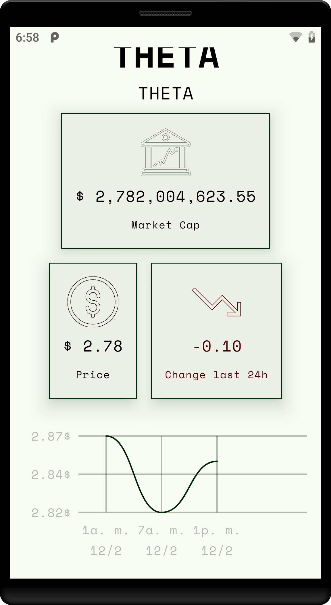

# 💰 **CoinScope**  

**CoinScope** is a **native Android application** designed to monitor cryptocurrency prices and trends. Leveraging modern technologies, clean architecture principles, and best practices, it ensures a seamless and efficient experience for cryptocurrency enthusiasts.  

  
  
  
  

## 🌟 **Features**  

- 🚀 **Real-time cryptocurrency tracking**: Stay updated with the latest prices and market trends.  
- 📊 **Interactive charts**: Analyze market movements with intuitive and dynamic visuals.  
- 🛠️ **Modern UI**: Built with **Jetpack Compose** for a responsive, sleek, and modern interface.  
- 🔄 **MVI (Model-View-Intent) architecture**: Ensures predictable state management and testable UI logic.  
- 🗂️ **Modular architecture**: Highly maintainable, scalable, and resilient to changes.

## 🛠️ **Development Approach**  

CoinScope is built with **industry best practices** and follows key principles to ensure a high-quality, maintainable, and scalable codebase. The app’s development approach embraces modern architectural patterns, modularization, and strong separation of concerns, providing a solid foundation for future growth. Here's a breakdown of the key strategies used in the development process:

### **🏗️ Architecture Principles**  

1. **SOLID Principles**:  
   - 📏 **Maintainability**: The code is designed to be flexible and easy to extend.  
   - 🔄 **Scalability**: As new features and functionalities are added, the app remains robust and adaptable.  
   - 🧩 **Separation of Concerns**: Every component has a clear responsibility, ensuring code is easier to manage, test, and modify.  

2. **Clean Architecture**:  
   - ⚙️ **Use Cases**: The core business logic is decoupled from the UI layer, making it independent of the `ViewModel` and enabling easier modifications and unit testing.  
   - 🏢 **Layered Separation**:  
     - **UI Layer** 💻: Handles all user interactions and displays content, ensuring the interface is intuitive and responsive.  
     - **Domain Layer** 🧠: Contains the application’s business logic and use cases, acting as the brain of the app.  
     - **Data Layer** 💾: Manages data retrieval and abstracts the complexities of data sources, including repositories and remote data fetching (e.g., with **Ktor**).  

### **🔲 Modularization**  

CoinScope follows a **modular architecture** to promote a clean, flexible, and reusable codebase. Each feature is encapsulated in its own module, making the app easy to maintain and extend:

- **`ui`** 🎨: Contains everything related to the user interface, ensuring a smooth, modern experience with **Jetpack Compose**.  
- **`domain`** 🧑‍💻: Holds the business logic, models, and use cases, keeping the application’s core functionality separated from other concerns.  
- **`data`** 📡: Handles all data-related tasks, including data sources, repositories, and communication with remote servers.  
- **`utils`** 🔧: Provides a set of reusable utility functions and helpers to reduce redundancy and increase efficiency across the app.  
- **`app`** 🏗️: The central module that ties everything together and serves as the entry point of the application.  

By using this architecture, CoinScope ensures that each part of the app is independent, maintainable, and easy to test, while also allowing for future updates and improvements with minimal effort.  

### **Dependency Injection**  

- Utilizes **Dagger Hilt** as the Inversion of Control (IoC) container for managing dependencies efficiently across all modules.  

## 🚀 **Technologies Used**  

- **Jetpack Compose**: For building modern, declarative, and responsive UIs.  
- **Ktor**: A flexible and asynchronous HTTP client for seamless data fetching.  
- **Dagger Hilt**: Simplifies dependency injection across the app.  
- **Kotlin Coroutines & Flows**: Provides a robust and reactive way to handle asynchronous data streams.  
- **MVI Architecture**: Implements a unidirectional data flow for predictable and testable state management.

## **App screenshots**  

  
  &nbsp;&nbsp;&nbsp;
  
  &nbsp;&nbsp;&nbsp;
  

